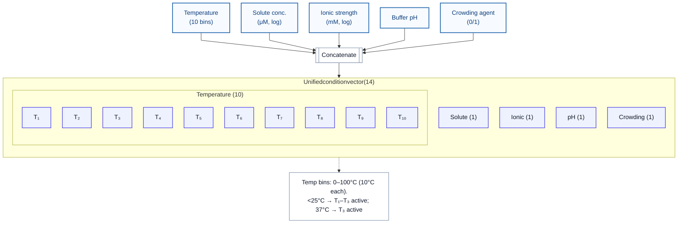

# Dataset Splitting

## Splitting Strategies

OpenPhase provides multiple splitting strategies for robust model evaluation and generalization.

### Random Split
- Randomly split into training and test sets
- Used only as a baseline

### Stratified by Phase Outcome
- Maintain the same ratio of **y = 0 / y = 1** in training and test sets  
- Mitigates class imbalance and ensures better generalization

### Condition-based Split
Example: **Temperature**
- Five ranges:  
  0–20°C, 20–40°C, 40–60°C, 60–80°C, 80–100°C
- Three settings:
  1. **Stratified**: keep ratio of temperature ranges consistent
  2. **Zero-shot**: training set contains all entries from one range, test set contains all from others
  3. **Few-shot**: small number of samples from a specific range included in training, rest in test set  

Applied similarly to:
- Solvent concentration (quintiles)
- Ionic strength (quintiles)
- pH: 3.5–5.5, 5.5–7.5, 7.5–9.5
- Crowding agent: binary stratified split only

### Component-based Split
- Each multicomponent system type (e.g., protein(1), protein(2), protein(1)+DNA) treated separately
- Enables fair evaluation per system type

---

## User-friendly Dataset Interface

OpenPhase offers a PyTorch-compatible dataset interface:
- Inherits from `torch.utils.data.Dataset`
- Easy to download, access entries, and retrieve **x**, **c**, **y** values
- Works seamlessly with PyTorch `DataLoader`
- Includes:
  - Precomputed embeddings (proteins, RNA, DNA, conditions)
  - Predefined split functions
  - Extra interface for **phase diagram grids** access and visualization in db2
- Transparent processing steps, enabling:
  - Error correction
  - Adding new entries
  - Custom adaptation for specific research needs

