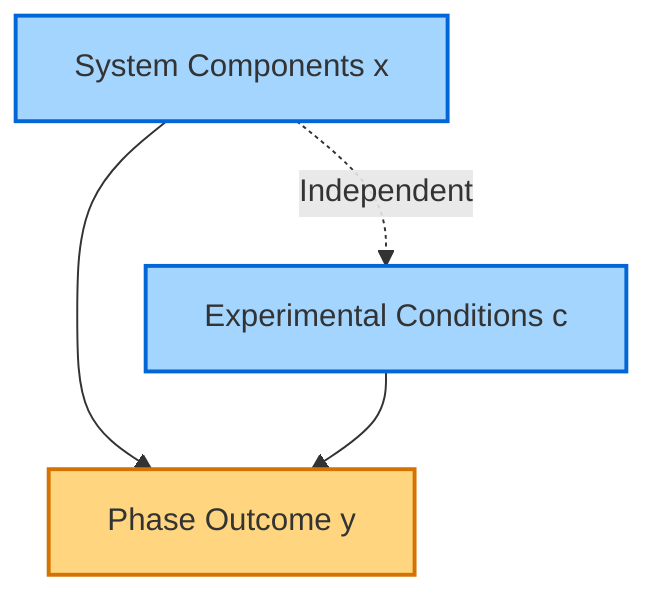

# Tasks Overview

OpenPhase explores phase-separating biosystems through a unified probabilistic framework, involving three core tasks.

---

## Task 1: Condition-Aware Phase Outcome Prediction

**Goal:**  
Predict the probability of phase separation given:
- **System components** \( x \) — e.g., protein, RNA, DNA embeddings.
- **Experimental conditions** \( c \) — e.g., salt concentration, temperature, pH.

**Objective:**  
Estimate \( p(y \| x, c) \), where \( y \in \{0,1\} \) indicates phase separation (1) or single phase (0).

**Applications:**  
- Simulating phase diagrams.
- Predicting system behavior under untested conditions.

---

## Task 2: Condition Inference for a Phase System

**Goal:**  
Infer likely experimental conditions \( c \) that could yield a known phase outcome \( y \) for a given system \( x \).

**Objective:**  
Estimate the posterior distribution \( p(c \| x, y) \).

**Applications:**  
- Hypothesis generation: identify environmental factors influencing phase separation.
- Map phase boundaries \( B_c \) between single-phase and two-phase regions.
- Understand critical thresholds, cooperative effects, and condition-dependent behaviors.

---

## Task 3: Phase System Design

**Goal:**  
Design novel system components \( x \) (primarily proteins) that achieve a desired phase outcome \( y \) under target conditions \( c \).

**Objective:**  
Sample from \( p(x \| y, c) \) using conditional generative modeling.

**Applications:**  
- **In silico** protein design for synthetic biology.
- Utilize distribution landscapes \( p(x \| y, c) \) and diffusion-based generative models.

**Notable Approaches:**
- **PRO-LDM** — diffusion modeling in latent space for controlled protein property design.
- **ProteinSGM** — generates novel folds beyond training data.
- **RFdiffusion** — adapts RoseTTAFold for diverse backbone generation tasks.
- **MapDiff** — discrete diffusion for inverse protein folding, integrating graph-based denoising and structural context modeling.

---

## Task Comparison Table

| Task | Input | Target Prediction / Generation | Key Output | Example Applications |
|------|-------|--------------------------------|------------|----------------------|
| **1. Outcome Prediction** | \( x \) (system), \( c \) (conditions) | \( p(y \| x, c) \) | Probability of phase separation | Phase diagram simulation, behavior prediction |
| **2. Condition Inference** | \( x \) (system), \( y \) (outcome) | \( p(c \| x, y) \) | Likely experimental conditions | Hypothesis generation, phase boundary mapping |
| **3. System Design** | \( y \) (desired outcome), \( c \) (target conditions) | \( p(x \| y, c) \) | New system components (e.g., proteins) | Synthetic biology, novel protein design |

---

## Probabilistic Graphical Model

---

## Flow Draft

